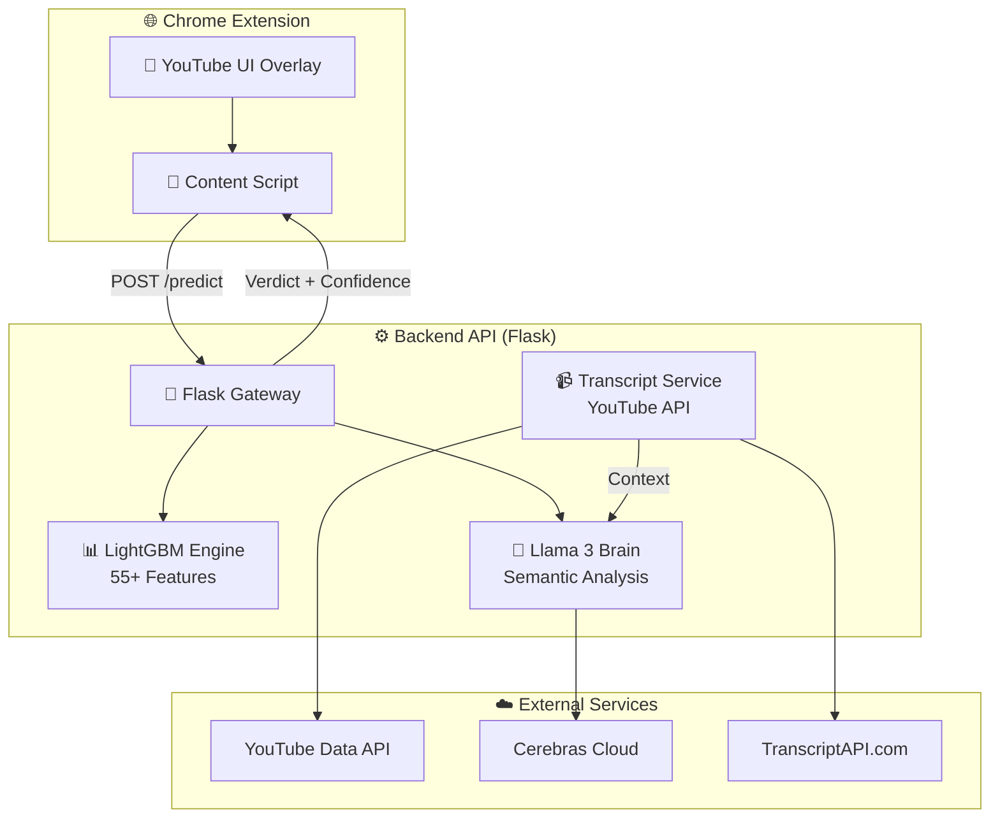
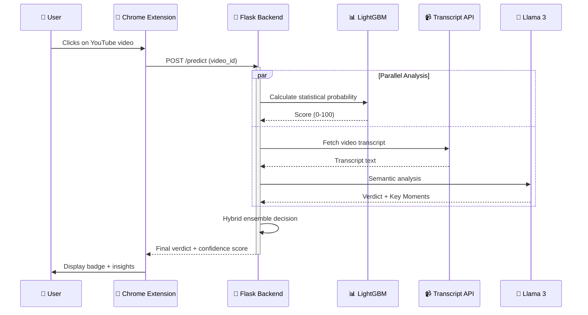
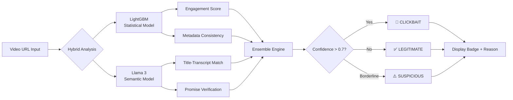

# 🎯 Clickbait Clarifier

## 🚫 Stop Wasting Time on Misleading Videos

 

  

Clickbait Clarifier is an AI-powered Chrome extension that detects and flags deceptive YouTube content in real-time using a hybrid approach — combining LightGBM statistical learning with Llama 3 semantic analysis.

📌 Table of Contents
Key Features

System Architecture

How It Works

Tech Stack

Getting Started

Performance Metrics

Contributing

Acknowledgments

✨ Key Features
<table> <thead> <tr> <th align="center">Feature</th> <th align="left">Description</th> </tr> </thead> <tbody> <tr> <td align="center">🧠 <strong>Hybrid Detection Engine</strong></td> <td align="left">LightGBM model trained on 55+ statistical features (engagement ratios, title-description consistency, etc.)</td> </tr> <tr> <td align="center">🤖 <strong>LLM Verification</strong></td> <td align="left">Deep semantic analysis via Llama 3 (Cerebras Cloud) to verify titles against transcripts</td> </tr> <tr> <td align="center">📝 <strong>Transcript Verification</strong></td> <td align="left">Fetches and analyzes video transcripts to find "Key Moments" where promises are fulfilled</td> </tr> <tr> <td align="center">🔌 <strong>Real-Time Extension</strong></td> <td align="left">Sleek Chrome extension adding status badges directly to YouTube interface</td> </tr> <tr> <td align="center">🔑 <strong>Smart Key Rotation</strong></td> <td align="left">Automatic rotation of Transcripts API keys to handle rate limits and quotas</td> </tr> <tr> <td align="center">⚡ <strong>40% Faster Processing</strong></td> <td align="left">Optimized backend pipelines for real-time responses</td> </tr> </tbody> </table>
🏗️ System Architecture
🌐 High-Level Overview
The system bridges a Chrome content script with a modular Flask backend powered by high-performance AI models.

🔄 Request Flow (Sequence Diagram)

🧭 Decision Flowchart

⚙️ How It Works
1. Statistical Analysis (LightGBM)
Analyzes 55+ features including:

📊 Title-to-description consistency

📈 Engagement ratios (likes/dislikes, views/comments)

👤 Uploader history and patterns

🖼️ Thumbnail analysis (face expressions, text overlays)

2. Semantic Analysis (Llama 3)
✅ Verifies if the title promise matches the actual content

🔍 Identifies "Key Moments" where promises are fulfilled

🚫 Detects exaggerations, false claims, and misleading statements

3. Hybrid Ensemble
⚖️ Combines both models using weighted scoring

📊 Produces final verdict with confidence score

💡 Provides explanation for each detection

🛠️ Tech Stack
<table>
  <thead>
    <tr>
      <th align="center">Category</th>
      <th align="left">Technologies</th>
    </tr>
  </thead>
  <tbody>
    <tr>
      <td align="center">🎨 <strong>Frontend</strong></td>
      <td align="left">JavaScript (Chrome Extension API), CSS3 (Glassmorphism UI), HTML5</td>
    </tr>
    <tr>
      <td align="center">⚙️ <strong>Backend</strong></td>
      <td align="left">Flask (Python), Gunicorn, Nginx</td>
    </tr>
    <tr>
      <td align="center">🧠 <strong>ML/AI</strong></td>
      <td align="left">LightGBM, Llama 3 (Cerebras Cloud), Pandas, Scikit-Learn, NumPy</td>
    </tr>
    <tr>
      <td align="center">🔌 <strong>APIs</strong></td>
      <td align="left">YouTube Data API v3, TranscriptAPI.com, Cerebras Cloud API</td>
    </tr>
    <tr>
      <td align="center">🛠️ <strong>Tools</strong></td>
      <td align="left">Git, Postman, VS Code, Jupyter Notebooks</td>
    </tr>
  </tbody>
</table>
🚀 Getting Started
Prerequisites
<table>
  <thead>
    <tr>
      <th align="center">Requirement</th>
      <th align="left">Version/Details</th>
    </tr>
  </thead>
  <tbody>
    <tr>
      <td align="center">🐍 <strong>Python</strong></td>
      <td align="left">3.9+</td>
    </tr>
    <tr>
      <td align="center">🌐 <strong>Browser</strong></td>
      <td align="left">Chrome Browser</td>
    </tr>
    <tr>
      <td align="center">🔑 <strong>API Keys</strong></td>
      <td align="left">YouTube, Cerebras, TranscriptAPI</td>
    </tr>
  </tbody>
</table>
bash
# Clone the repository
git clone https://github.com/sumedhpatil2005/AntiClickbait.git
cd AntiClickbait/backend

# Create virtual environment
python -m venv venv
source venv/bin/activate  # On Windows: venv\Scripts\activate

# Install dependencies
pip install -r requirements.txt

# Configure API keys
cp api_config.example.py api_config.py
# Edit api_config.py with your keys

# Run the server
python app.py
Extension Setup (Chrome)
<table>
  <thead>
    <tr>
      <th align="center">Step</th>
      <th align="left">Action</th>
    </tr>
  </thead>
  <tbody>
    <tr>
      <td align="center">1</td>
      <td align="left">Open <code>chrome://extensions/</code> in your browser</td>
    </tr>
    <tr>
      <td align="center">2</td>
      <td align="left">Enable <strong>"Developer mode"</strong> (toggle in top right)</td>
    </tr>
    <tr>
      <td align="center">3</td>
      <td align="left">Click <strong>"Load unpacked"</strong></td>
    </tr>
    <tr>
      <td align="center">4</td>
      <td align="left">Select the <strong><code>/extension</code></strong> folder from this project</td>
    </tr>
    <tr>
      <td align="center">5</td>
      <td align="left">Open any YouTube video and look for the detection badge below the title!</td>
    </tr>
  </tbody>
</table>
Environment Variables
<h3>🔐 Environment Variables</h3>

Create a <code>.env</code> file in your backend directory:

<table>
  <thead>
    <tr>
      <th align="center">Variable</th>
      <th align="left">Description</th>
      <th align="left">Example</th>
    </tr>
  </thead>
  <tbody>
    <tr>
      <td align="center">🔑 <code>YOUTUBE_API_KEY</code></td>
      <td align="left">YouTube Data API v3 key</td>
      <td align="left"><code>AIzaSyDxxxxxxxx</code></td>
    </tr>
    <tr>
      <td align="center">🧠 <code>CEREBRAS_API_KEY</code></td>
      <td align="left">Cerebras Cloud API key for Llama 3</td>
      <td align="left"><code>csk-xxxxxxxx</code></td>
    </tr>
    <tr>
      <td align="center">📝 <code>TRANSCRIPT_API_KEY</code></td>
      <td align="left">TranscriptAPI.com subscription key</td>
      <td align="left"><code>tapi-xxxxxxxx</code></td>
    </tr>
    <tr>
      <td align="center">⚙️ <code>FLASK_ENV</code></td>
      <td align="left">Flask environment mode</td>
      <td align="left"><code>production</code> or <code>development</code></td>
    </tr>
    <tr>
      <td align="center">🐛 <code>DEBUG</code></td>
      <td align="left">Debug mode toggle</td>
      <td align="left"><code>True</code> or <code>False</code></td>
    </tr>
  </tbody>
</table>

📊 Performance Metrics
<table>
  <thead>
    <tr>
      <th align="center">Metric</th>
      <th align="left">Value</th>
    </tr>
  </thead>
  <tbody>
    <tr>
      <td align="center">📊 <strong>Accuracy</strong></td>
      <td align="left">89.5% on test dataset</td>
    </tr>
    <tr>
      <td align="center">🎯 <strong>Precision</strong></td>
      <td align="left">87.2%</td>
    </tr>
    <tr>
      <td align="center">🔄 <strong>Recall</strong></td>
      <td align="left">91.3%</td>
    </tr>
    <tr>
      <td align="center">⚖️ <strong>F1 Score</strong></td>
      <td align="left">89.2%</td>
    </tr>
    <tr>
      <td align="center">⏱️ <strong>Avg Response Time</strong></td>
      <td align="left">1.2 seconds</td>
    </tr>
    <tr>
      <td align="center">🎬 <strong>Video Processing</strong></td>
      <td align="left">~500ms per video</td>
    </tr>
  </tbody>
</table>
🤝 Contributing
We welcome contributions! Here's how you can help:

Contribution Steps
<table>
  <thead>
    <tr>
      <th align="center">Step</th>
      <th align="left">Action</th>
    </tr>
  </thead>
  <tbody>
    <tr>
      <td align="center">1</td>
      <td align="left">Fork the repository</td>
    </tr>
    <tr>
      <td align="center">2</td>
      <td align="left">Create a feature branch (<code>git checkout -b feature/AmazingFeature</code>)</td>
    </tr>
    <tr>
      <td align="center">3</td>
      <td align="left">Commit your changes (<code>git commit -m 'Add some AmazingFeature'</code>)</td>
    </tr>
    <tr>
      <td align="center">4</td>
      <td align="left">Push to the branch (<code>git push origin feature/AmazingFeature</code>)</td>
    </tr>
    <tr>
      <td align="center">5</td>
      <td align="left">Open a Pull Request</td>
    </tr>
  </tbody>
</table>
Development Guidelines
📏 Follow PEP 8 for Python code

📝 Use meaningful commit messages

🧪 Add tests for new features

📚 Update documentation accordingly

📈 Roadmap
<table>
  <thead>
    <tr>
      <th align="center">Status</th>
      <th align="left">Feature</th>
    </tr>
  </thead>
  <tbody>
    <tr>
      <td align="center">⬜</td>
      <td align="left">Add support for Shorts/TikTok/Instagram</td>
    </tr>
    <tr>
      <td align="center">⬜</td>
      <td align="left">Implement user feedback loop for model improvement</td>
    </tr>
    <tr>
      <td align="center">⬜</td>
      <td align="left">Add Chrome Sync for user preferences</td>
    </tr>
    <tr>
      <td align="center">⬜</td>
      <td align="left">Develop Firefox extension version</td>
    </tr>
    <tr>
      <td align="center">⬜</td>
      <td align="left">Create dashboard for content creators</td>
    </tr>
    <tr>
      <td align="center">⬜</td>
      <td align="left">Add batch analysis for channel scanning</td>
    </tr>
  </tbody>
</table>

📜 Acknowledgments
🙏 Cerebras Cloud — For blazing-fast Llama 3 inference

🙏 TranscriptAPI — For robust YouTube subtitle retrieval

🙏 Open Source Community — For amazing libraries and tools

🙏 YouTube — For providing the platform (we love you anyway 😄)

📄 License
Distributed under the MIT License. See LICENSE for more information.

❤️ Made for a Cleaner YouTube Experience
🚫 Stop Clickbait. Start Watching.

© 2026 Clickbait Clarifier
