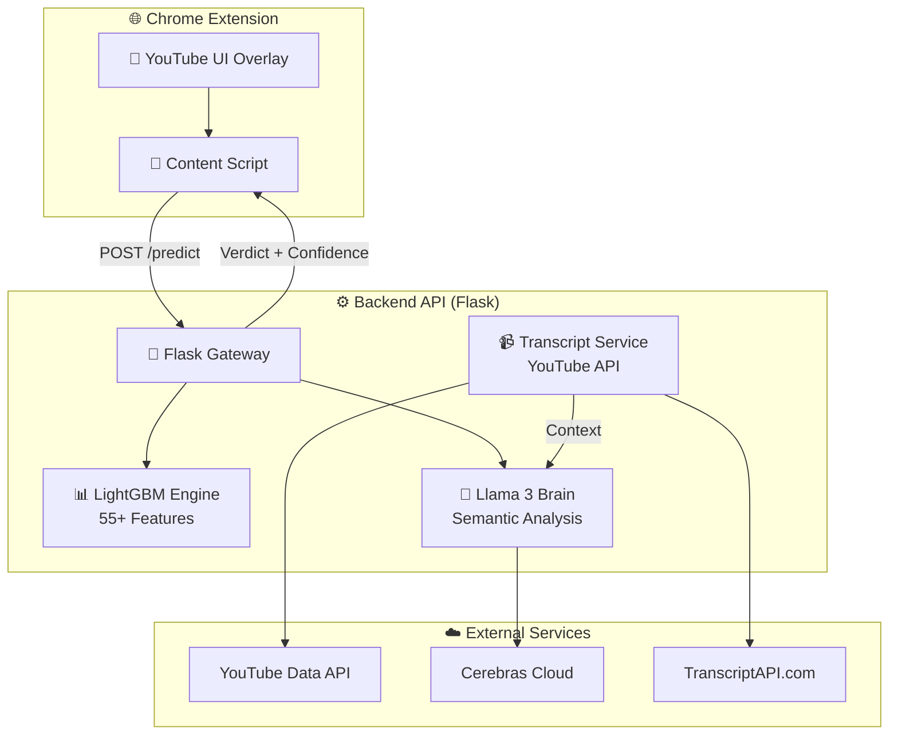
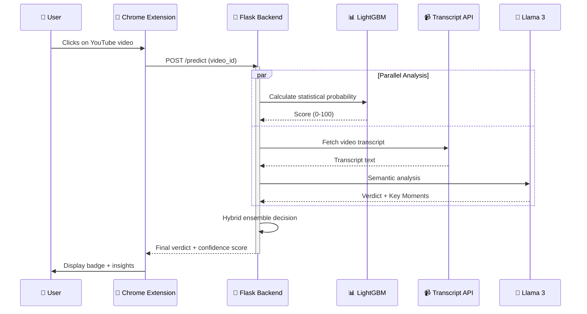
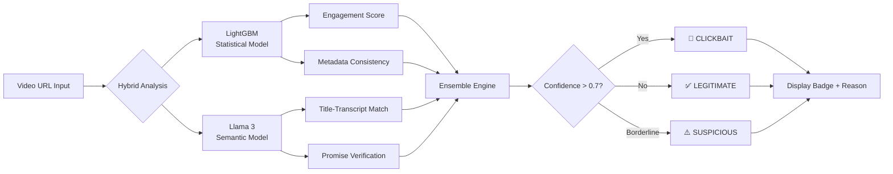

🎯 Clickbait Clarifier
Stop Wasting Time on Misleading Videos
https://img.shields.io/badge/license-MIT-blue.svg
https://img.shields.io/badge/Python-3.9+-green.svg
https://img.shields.io/badge/Flask-2.0+-red.svg
https://img.shields.io/badge/Chrome-Extension-yellow.svg

Clickbait Clarifier is an AI-powered Chrome extension that detects and flags deceptive YouTube content in real-time using a hybrid approach — combining LightGBM statistical learning with Llama 3 semantic analysis.

📌 Table of Contents
Key Features

System Architecture

How It Works

Tech Stack

Getting Started

Performance Metrics

Contributing

Acknowledgments

✨ Key Features
Feature	Description
🧠 Hybrid Detection Engine	LightGBM model trained on 55+ statistical features (engagement ratios, title-description consistency, etc.)
🤖 LLM Verification	Deep semantic analysis via Llama 3 (Cerebras Cloud) to verify titles against transcripts
📝 Transcript Verification	Fetches and analyzes video transcripts to find "Key Moments" where promises are fulfilled
🔌 Real-Time Extension	Sleek Chrome extension adding status badges directly to YouTube interface
🔑 Smart Key Rotation	Automatic rotation of Transcripts API keys to handle rate limits and quotas
⚡ 40% Faster Processing	Optimized backend pipelines for real-time responses
🏗️ System Architecture
High-Level Overview
The system bridges a Chrome content script with a modular Flask backend powered by high-performance AI models.

Request Flow (Sequence Diagram)

Decision Flowchart

⚙️ How It Works
1. Statistical Analysis (LightGBM)
Analyzes 55+ features including:

Title-to-description consistency

Engagement ratios (likes/dislikes, views/comments)

Uploader history and patterns

Thumbnail analysis (face expressions, text overlays)

2. Semantic Analysis (Llama 3)
Verifies if the title promise matches the actual content

Identifies "Key Moments" where promises are fulfilled

Detects exaggerations, false claims, and misleading statements

3. Hybrid Ensemble
Combines both models using weighted scoring

Produces final verdict with confidence score

Provides explanation for each detection

🛠️ Tech Stack
Category	Technologies
Frontend	JavaScript (Chrome Extension API), CSS3 (Glassmorphism UI), HTML5
Backend	Flask (Python), Gunicorn, Nginx
ML/AI	LightGBM, Llama 3 (Cerebras Cloud), Pandas, Scikit-Learn, NumPy
APIs	YouTube Data API v3, TranscriptAPI.com, Cerebras Cloud API
Tools	Git, Postman, VS Code, Jupyter Notebooks
Deployment	Docker, AWS/GCP (optional), Heroku
🚀 Getting Started
Prerequisites
Python 3.9+

Chrome Browser

API Keys (YouTube, Cerebras, TranscriptAPI)

1. Backend Setup (Flask API)
bash
# Clone the repository
git clone https://github.com/sumedhpatil2005/AntiClickbait.git
cd AntiClickbait/backend

# Create virtual environment
python -m venv venv
source venv/bin/activate  # On Windows: venv\Scripts\activate

# Install dependencies
pip install -r requirements.txt

# Configure API keys
cp api_config.example.py api_config.py
# Edit api_config.py with your keys

# Run the server
python app.py
2. Extension Setup (Chrome)
Open chrome://extensions/ in your browser

Enable "Developer mode" (toggle in top right)

Click "Load unpacked"

Select the /extension folder from this project

Navigate to any YouTube video and look for the detection badge below the title!

3. Environment Variables
bash
# .env file
YOUTUBE_API_KEY=your_key_here
CEREBRAS_API_KEY=your_key_here
TRANSCRIPT_API_KEY=your_key_here
FLASK_ENV=production
DEBUG=False
📊 Performance Metrics
Metric	Value
Accuracy	89.5% on test dataset
Precision	87.2%
Recall	91.3%
F1 Score	89.2%
Avg Response Time	1.2 seconds
Video Processing	~500ms per video
🤝 Contributing
We welcome contributions! Here's how you can help:

🍴 Fork the repository

🌿 Create a feature branch (git checkout -b feature/AmazingFeature)

💾 Commit your changes (git commit -m 'Add some AmazingFeature')

📤 Push to the branch (git push origin feature/AmazingFeature)

🎯 Open a Pull Request

Development Guidelines
Follow PEP 8 for Python code

Use meaningful commit messages

Add tests for new features

Update documentation accordingly

📈 Roadmap
Add support for Shorts/TikTok/Instagram

Implement user feedback loop for model improvement

Add Chrome Sync for user preferences

Develop Firefox extension version

Create dashboard for content creators

Add batch analysis for channel scanning

📜 Acknowledgments
Cerebras Cloud — For blazing-fast Llama 3 inference

TranscriptAPI — For robust YouTube subtitle retrieval

Open Source Community — For amazing libraries and tools

YouTube — For providing the platform (we love you anyway 😄)

📄 License
Distributed under the MIT License. See LICENSE for more information.

<p align="center"> <b>Made with ❤️ for a safer, cleaner YouTube experience</b><br> <sub>© 2025 Clickbait Clarifier | Stop Clickbait, Start Watching</sub> </p> ```
